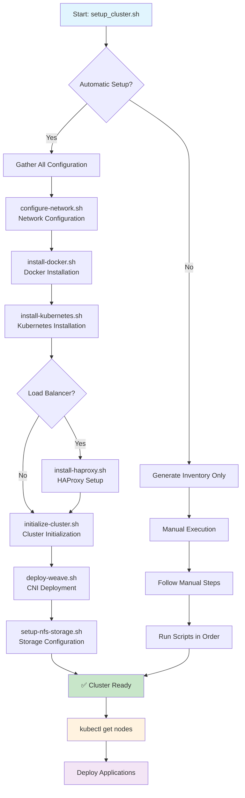
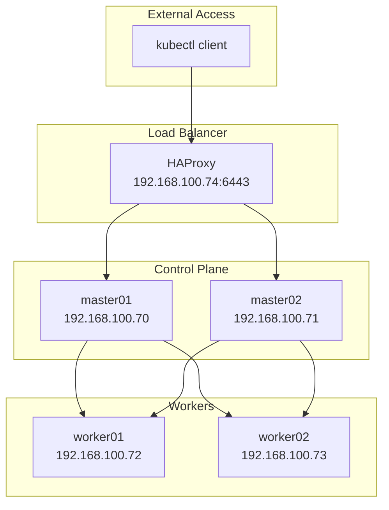

# Kubernetes Cluster Automation Suite

Enterprise-grade Kubernetes cluster automation using Ansible with HAProxy load balancing, NFS storage, and comprehensive deployment tools.

## 📋 Table of Contents

- [Quick Start](#-quick-start)
- [Complete Automation Workflow](#-complete-automation-workflow)
- [Component Overview](#-component-overview)
- [Detailed Component Guide](#-detailed-component-guide)
- [Security Configuration](#-security-configuration)
- [Network Architecture](#-network-architecture)
- [Verification and Monitoring](#-verification-and-monitoring)
- [Testing Specific Tasks](#-testing-specific-tasks)
- [Troubleshooting](#-troubleshooting)
- [Maintenance Operations](#-maintenance-operations)

## 🚀 Quick Start

### Prerequisites
- Ansible 2.18+ installed on control machine
- Target machines: Ubuntu/Debian with SSH access
- Minimum 2 master nodes + 1 load balancer + 2 workers (5 nodes total)
- Each node: 2+ CPUs, 4GB+ RAM, 20GB+ disk

### Option 1: Complete Automatic Setup (Recommended)
```bash
# Single command for complete cluster deployment
./setup_cluster.sh
# Follow interactive prompts and choose automatic setup
```

### Option 2: Manual Step-by-Step Setup
```bash
# 1. Configure cluster inventory and credentials
./setup_cluster.sh

# 2. Configure network settings
./configure-network.sh

# 3. Install Docker on all nodes
./install-docker.sh

# 4. Install Kubernetes on all nodes  
./install-kubernetes.sh

# 5. Setup HAProxy load balancer (if selected)
./install-haproxy.sh

# 6. Initialize the cluster
./initialize-cluster.sh

# 7. Deploy Weave CNI network plugin
./deploy-weave.sh

# 8. Setup NFS storage with local-path-provisioner
./setup-nfs-storage.sh
```

## 🔄 Complete Automation Workflow



## 📋 Component Overview

### Core Scripts
| Script | Purpose | Features | Execution Options |
|--------|---------|----------|-------------------|
| `setup_cluster.sh` | Interactive inventory creation with automatic setup | Node configuration, credentials management, complete automation | Interactive prompts + automatic cluster deployment |
| `configure-network.sh` | Network configuration and /etc/hosts setup | Host resolution, network validation | Network configuration across all nodes |
| `install-docker.sh` | Docker installation automation | Multiple installation modes, version management | 11 execution options including dry-run |
| `install-kubernetes.sh` | Kubernetes deployment | kubeadm, kubelet, kubectl with apt repositories | 12 execution options including verification |
| `install-haproxy.sh` | Load balancer configuration | HAProxy setup with health checks and monitoring | 10 execution options including statistics |
| `initialize-cluster.sh` | Cluster initialization | Multi-master setup, token management, kubectl config | 8 execution options including verification |
| `deploy-weave.sh` | CNI network plugin deployment | Weave CNI installation, taint removal | 8 execution options including pod verification |
| `setup-nfs-storage.sh` | NFS storage and provisioner setup | NFS server/client config, local-path-provisioner | Interactive NFS configuration with testing |

### Ansible Infrastructure
```
Kubernetes/
├── playbooks/                 # Ansible automation playbooks
│   ├── configure-network.yml  # Network configuration
│   ├── install-docker.yml     # Docker installation
│   ├── install-kubernetes.yml # Kubernetes installation
│   ├── install-haproxy.yml    # HAProxy load balancer
│   ├── initialize-cluster.yml # Cluster initialization
│   ├── deploy-weave.yml       # Weave CNI deployment
│   └── nfs-setup.yml          # NFS storage configuration
├── templates/                 # Configuration templates
│   ├── haproxy.cfg.j2         # HAProxy configuration
│   └── weave.yaml             # Weave CNI manifest
├── manifests/                 # Kubernetes manifests
│   ├── weave.yaml             # Weave CNI configuration
│   └── local-path-provisioner.yaml # Storage provisioner
├── group_vars/all/           # Global configuration
│   ├── docker.yml            # Docker settings
│   ├── haproxy.yml           # HAProxy settings
│   ├── kubernetes.yml        # Kubernetes settings
│   └── vault.yml             # Encrypted credentials
├── inventory.ini             # Target node inventory
└── ansible.cfg              # Ansible configuration
```

## � Detailed Component Guide

### 1. Cluster Setup (`setup_cluster.sh`)
**Purpose**: Interactive inventory creation with automatic cluster deployment option

**Features**:
- Guided node count and IP configuration
- Individual username collection per node
- Automatic inventory.ini generation
- Vault-encrypted credential storage
- **Automatic Setup Mode**: Complete cluster deployment with one command
- **Manual Setup Mode**: Generate inventory for step-by-step execution
- Input validation and error handling

**Execution Options**:
```bash
./setup_cluster.sh
# Interactive prompts for:
# - Number of master nodes (default: 2)
# - Number of worker nodes (default: 2)
# - Load balancer IP and credentials
# - Individual node IPs and usernames
# - SSH password (encrypted in vault)
# - Automatic vs Manual setup choice
# - NFS configuration (for automatic setup)
```

### 2. Network Configuration (`configure-network.sh`)
**Purpose**: Configure /etc/hosts and network settings across all nodes

**Features**:
- Host resolution configuration
- Network connectivity validation
- Gateway configuration
- DNS settings optimization

**Execution Options**:
```bash
./configure-network.sh
# Automated network configuration across all inventory nodes
```

### 3. Docker Installation (`install-docker.sh`)
**Purpose**: Automated Docker Engine deployment across all nodes

**Features**:
- Official Docker repository installation
- Version management (Docker 28.4.0)
- User group management
- containerd CRI configuration
- Service enablement and verification
- Comprehensive error handling

**Execution Options**:
```bash
./install-docker.sh
# Options:
# 1. Install on all nodes (masters + workers)
# 2. Install on masters only
# 3. Install on workers only
# 4. Install on specific node
# 5. Verify installation
# 6. Uninstall Docker
# 7. Update Docker version
# 8. Check Docker status
# 9. Dry-run mode
# 10. Verbose output
# 11. Help/documentation
```

### 4. Kubernetes Installation (`install-kubernetes.sh`)
**Purpose**: Kubernetes component deployment (kubeadm, kubelet, kubectl)

**Features**:
- Kubernetes v1.34.1 installation
- Official Kubernetes apt repository
- Component verification
- Service management
- Hold package versions

**Execution Options**:
```bash
./install-kubernetes.sh
# Options:
# 1. Install on all nodes
# 2. Install on masters only
# 3. Install on workers only
# 4. Install on specific node
# 5. Verify installation
# 6. Update Kubernetes
# 7. Check status
# 8. Uninstall components
# 9. Reset kubeadm
# 10. Dry-run mode
# 11. Verbose output
# 12. Help/documentation
```

### 5. HAProxy Load Balancer (`install-haproxy.sh`)
**Purpose**: High-availability load balancer for Kubernetes API servers

**Features**:
- HAProxy 2.8 installation and configuration
- Round-robin load balancing across master nodes
- Health checks and monitoring
- Statistics interface (port 8404)
- Configuration syntax validation

**Load Balancer Configuration**:
```yaml
Frontend: 192.168.100.74:6443 (Kubernetes API)
Backend: master01:6443, master02:6443
Algorithm: Round-robin
Health Checks: TCP port 6443
Stats Interface: http://192.168.100.74:8404/stats
```

**Execution Options**:
```bash
./install-haproxy.sh
# Options:
# 1. Install and configure HAProxy
# 2. Update configuration only
# 3. Restart HAProxy service
# 4. Check HAProxy status
# 5. View configuration
# 6. Test load balancer
# 7. View statistics
# 8. Uninstall HAProxy
# 9. Dry-run mode
# 10. Help/documentation
```

### 6. Cluster Initialization (`initialize-cluster.sh`)
**Purpose**: Automated Kubernetes cluster bootstrap and node joining

**Features**:
- Multi-master cluster initialization
- Automatic join token management
- Certificate upload for HA
- Phased deployment (master01 → master02 → workers)
- kubectl configuration and bash completion setup
- Comprehensive verification

**Cluster Configuration**:
```yaml
Control Plane Endpoint: 192.168.100.74:6443 (HAProxy)
Pod Network CIDR: 10.244.0.0/16 (CNI compatible)
Primary Master: master01 (initialization node)
Secondary Master: master02 (joins as control plane)
Workers: worker01, worker02 (join as workers)
Certificate Management: Auto-upload enabled
kubectl Config: Automatic setup with bash completion
```

**Execution Options**:
```bash
./initialize-cluster.sh
# Options:
# 1. Full cluster initialization (all nodes)
# 2. Initialize master01 only
# 3. Join master02 only
# 4. Join workers only
# 5. Verify cluster status
# 6. Reset cluster
# 7. Dry-run mode
# 8. Verbose output
```

### 7. CNI Network Plugin (`deploy-weave.sh`)
**Purpose**: Deploy Weave CNI for pod networking

**Features**:
- Weave CNI v0.0.32 deployment
- Network policy support
- Automatic pod network configuration
- Control plane taint removal
- Network connectivity verification

**Network Configuration**:
```yaml
CNI Plugin: Weave Net
Pod Network: 10.40.x.x, 10.44.x.x (automatic assignment)
Network Policies: Supported
Encryption: Available (configurable)
```

**Execution Options**:
```bash
./deploy-weave.sh
# Options:
# 1. Deploy Weave CNI and remove taints
# 2. Deploy CNI only
# 3. Remove taints only
# 4. Verify CNI status
# 5. Restart Weave pods
# 6. Remove Weave CNI
# 7. Dry-run mode
# 8. Verbose output
```

### 8. NFS Storage Setup (`setup-nfs-storage.sh`)
**Purpose**: Configure NFS shared storage with local-path-provisioner

**Features**:
- Interactive NFS server selection
- NFS server and client configuration
- local-path-provisioner deployment
- Default storage class configuration
- Storage functionality testing

**Storage Configuration**:
```yaml
NFS Server: Selectable from available nodes (master01 recommended)
Share Directory: Configurable (default: /kubernetes)
Provisioner: rancher/local-path-provisioner:v0.0.32
Storage Class: local-path (set as default)
Access Modes: ReadWriteOnce
Reclaim Policy: Delete
```

**Execution Process**:
```bash
./setup-nfs-storage.sh
# Interactive configuration:
# 1. Select NFS server node from available options
# 2. Configure share directory path
# 3. Automatic NFS server installation and configuration
# 4. NFS client setup on remaining nodes
# 5. Directory creation and permission setup
# 6. NFS exports configuration
# 7. Mount verification on all nodes
# 8. local-path-provisioner deployment
# 9. Default storage class configuration
```

## 🔐 Security Configuration

### Credential Management
- **Ansible Vault**: Encrypted password storage in `group_vars/all/vault.yml`
- **SSH Keys**: Recommended for production (password auth for testing)
- **Certificate Management**: Automatic CA and certificate handling via kubeadm

### Network Security
- **Firewall Rules**: Ensure ports 6443, 2379-2380, 10250-10252 are open
- **Load Balancer**: HAProxy provides single entry point with health checks
- **Pod Network**: Isolated pod networking with Flannel CNI

## 🌐 Network Architecture



## 📊 Verification and Monitoring

### Cluster Health Checks
```bash
# Basic cluster status
kubectl --kubeconfig=admin.conf get nodes -o wide
kubectl --kubeconfig=admin.conf get pods --all-namespaces

# Load balancer verification
curl -k https://192.168.100.74:6443/version
kubectl --server=https://192.168.100.74:6443 --kubeconfig=admin.conf cluster-info

# HAProxy statistics
curl http://192.168.100.74:8404/stats

# Service verification
ansible all -i inventory.ini -m command -a 'systemctl status docker' --ask-vault-pass
ansible all -i inventory.ini -m command -a 'systemctl status kubelet' --ask-vault-pass
```

### Post-Installation Tasks
```bash
# 1. Verify cluster status
kubectl --kubeconfig=admin.conf get nodes -o wide
kubectl --kubeconfig=admin.conf get pods --all-namespaces

# 2. Test pod deployment
kubectl --kubeconfig=admin.conf create deployment nginx-test --image=nginx --replicas=3
kubectl --kubeconfig=admin.conf get pods -o wide

# 3. Test storage provisioning
kubectl --kubeconfig=admin.conf apply -f - <<EOF
apiVersion: v1
kind: PersistentVolumeClaim
metadata:
  name: test-pvc
spec:
  accessModes: [ReadWriteOnce]
  storageClassName: local-path
  resources:
    requests:
      storage: 1Gi
EOF

# 4. Verify load balancer
curl -k https://192.168.100.74:6443/version
kubectl --server=https://192.168.100.74:6443 --kubeconfig=admin.conf cluster-info

# 5. HAProxy statistics
curl http://192.168.100.74:8404/stats

# 6. Clean up test resources
kubectl --kubeconfig=admin.conf delete deployment nginx-test
kubectl --kubeconfig=admin.conf delete pvc test-pvc
```

## 🧪 Testing Specific Tasks

### Running Individual Playbook Tasks

#### 1. Test kubectl Configuration Only
```bash
# Test kubectl setup on master nodes
ansible-playbook -i inventory.ini playbooks/initialize-cluster.yml --tags kubectl_config --ask-vault-pass
```

#### 2. Test NFS Setup Components
```bash
# Test complete NFS setup
ansible-playbook -i inventory.ini playbooks/nfs-setup.yml --ask-vault-pass \
  --extra-vars "ansible_nfs_server=master01 ansible_nfs_share_dir=/kubernetes"

# Test NFS server configuration only
ansible-playbook -i inventory.ini playbooks/nfs-setup.yml --tags nfs_server --ask-vault-pass \
  --extra-vars "ansible_nfs_server=master01 ansible_nfs_share_dir=/kubernetes"

# Test NFS client configuration only
ansible-playbook -i inventory.ini playbooks/nfs-setup.yml --tags nfs_client --ask-vault-pass \
  --extra-vars "ansible_nfs_server=master01 ansible_nfs_share_dir=/kubernetes"
```

#### 3. Test Docker Installation Components
```bash
# Test Docker installation on specific node groups
ansible-playbook -i inventory.ini playbooks/docker-install.yml --limit masters --ask-vault-pass
ansible-playbook -i inventory.ini playbooks/docker-install.yml --limit workers --ask-vault-pass

# Test containerd configuration only
ansible masters:workers -i inventory.ini -m shell -a "systemctl status containerd" --ask-vault-pass
```

#### 4. Test Kubernetes Components
```bash
# Test Kubernetes installation on specific nodes
ansible-playbook -i inventory.ini playbooks/kubernetes-install.yml --limit master01 --ask-vault-pass

# Verify kubelet status
ansible masters:workers -i inventory.ini -m shell -a "systemctl status kubelet" --ask-vault-pass
```

#### 5. Test HAProxy Configuration
```bash
# Test HAProxy configuration only
ansible-playbook -i inventory.ini playbooks/haproxy-install.yml --ask-vault-pass

# Verify HAProxy configuration syntax
ansible loadbalancers -i inventory.ini -m shell -a "haproxy -c -f /etc/haproxy/haproxy.cfg" --ask-vault-pass
```

#### 6. Test Weave CNI Deployment
```bash
# Test Weave CNI deployment
ansible-playbook -i inventory.ini playbooks/deploy-weave.yml --ask-vault-pass

# Check Weave pod status
ansible master01 -i inventory.ini -m shell -a "kubectl get pods -n kube-system | grep weave" --ask-vault-pass
```

### Ad-hoc Testing Commands

#### Network Connectivity Tests
```bash
# Test SSH connectivity
ansible all -i inventory.ini -m ping --ask-vault-pass

# Test specific service connectivity
ansible all -i inventory.ini -m shell -a "nc -zv 192.168.100.74 6443" --ask-vault-pass

# Test DNS resolution
ansible all -i inventory.ini -m shell -a "nslookup master01" --ask-vault-pass
```

#### Service Status Verification
```bash
# Check Docker status on all nodes
ansible all -i inventory.ini -m shell -a "systemctl is-active docker" --ask-vault-pass

# Check kubelet status on masters and workers
ansible masters:workers -i inventory.ini -m shell -a "systemctl is-active kubelet" --ask-vault-pass

# Check HAProxy status
ansible loadbalancers -i inventory.ini -m shell -a "systemctl is-active haproxy" --ask-vault-pass

# Check NFS server status
ansible master01 -i inventory.ini -m shell -a "systemctl is-active nfs-kernel-server" --ask-vault-pass
```

#### Storage Testing
```bash
# Test NFS mount on all nodes
ansible all -i inventory.ini -m shell -a "mount | grep kubernetes" --ask-vault-pass

# Test NFS write permissions
ansible all -i inventory.ini -m shell -a "touch /kubernetes/test-$(hostname).txt" --ask-vault-pass
ansible all -i inventory.ini -m shell -a "ls -la /kubernetes/" --ask-vault-pass

# Clean up test files
ansible all -i inventory.ini -m shell -a "rm -f /kubernetes/test-*.txt" --ask-vault-pass
```

#### Cluster Component Testing
```bash
# Test cluster API via load balancer
ansible master01 -i inventory.ini -m shell -a "kubectl --server=https://192.168.100.74:6443 get nodes" --ask-vault-pass

# Test pod creation and scheduling
ansible master01 -i inventory.ini -m shell -a "kubectl run test-pod --image=busybox --command -- sleep 60" --ask-vault-pass
ansible master01 -i inventory.ini -m shell -a "kubectl get pods -o wide" --ask-vault-pass
ansible master01 -i inventory.ini -m shell -a "kubectl delete pod test-pod" --ask-vault-pass
```

### Debug Mode Testing
```bash
# Run playbooks with maximum verbosity
ansible-playbook -i inventory.ini playbooks/initialize-cluster.yml -vvv --ask-vault-pass

# Test specific tasks with debug information
ansible master01 -i inventory.ini -m setup --ask-vault-pass | grep ansible_host

# Check gathered facts for specific node
ansible master01 -i inventory.ini -m setup --ask-vault-pass --tree /tmp/facts
```

## 🔧 Troubleshooting

### Common Issues and Solutions

#### 1. SSH Connection Issues
```bash
# Test SSH connectivity
ansible all -i inventory.ini -m ping --ask-vault-pass

# Fix SSH host key issues
ssh-keygen -f ~/.ssh/known_hosts -R [node-ip]

# Test individual node connection
ssh -o StrictHostKeyChecking=no user@node-ip

# Check SSH service on remote nodes
ansible all -i inventory.ini -m shell -a "systemctl status ssh" --ask-vault-pass
```

#### 2. Ansible Vault Issues
```bash
# Re-encrypt vault file with new password
ansible-vault rekey group_vars/all/vault.yml

# View encrypted vault contents
ansible-vault view group_vars/all/vault.yml

# Edit vault file
ansible-vault edit group_vars/all/vault.yml

# Test vault access
ansible all -i inventory.ini -m debug -a "var=vault_password" --ask-vault-pass
```

#### 3. Docker Installation Failures
```bash
# Check Docker status
ansible all -i inventory.ini -m shell -a "systemctl status docker" --ask-vault-pass

# Remove Docker completely and reinstall
ansible all -i inventory.ini -m shell -a "apt remove -y docker.io docker-ce containerd.io" --become --ask-vault-pass
ansible all -i inventory.ini -m shell -a "apt autoremove -y" --become --ask-vault-pass
./install-docker.sh  # Run again

# Check containerd CRI configuration
ansible all -i inventory.ini -m shell -a "cat /etc/containerd/config.toml | grep -A5 plugins" --ask-vault-pass

# Test Docker functionality
ansible all -i inventory.ini -m shell -a "docker run hello-world" --ask-vault-pass
```

#### 4. Kubernetes Installation Issues
```bash
# Check Kubernetes components
ansible all -i inventory.ini -m shell -a "kubeadm version" --ask-vault-pass
ansible all -i inventory.ini -m shell -a "kubelet --version" --ask-vault-pass
ansible all -i inventory.ini -m shell -a "kubectl version --client" --ask-vault-pass

# Verify kubelet status and logs
ansible masters:workers -i inventory.ini -m shell -a "systemctl status kubelet" --ask-vault-pass
ansible masters:workers -i inventory.ini -m shell -a "journalctl -u kubelet --no-pager -l" --ask-vault-pass

# Check Kubernetes repository configuration
ansible all -i inventory.ini -m shell -a "cat /etc/apt/sources.list.d/kubernetes.list" --ask-vault-pass

# Reset problematic kubeadm configuration
ansible <failed-node> -i inventory.ini -m shell -a "kubeadm reset -f" --become --ask-vault-pass
```

#### 5. HAProxy Load Balancer Issues
```bash
# Check HAProxy configuration syntax
ansible loadbalancers -i inventory.ini -m shell -a "haproxy -c -f /etc/haproxy/haproxy.cfg" --ask-vault-pass

# Check HAProxy service status
ansible loadbalancers -i inventory.ini -m shell -a "systemctl status haproxy" --ask-vault-pass

# Test load balancer connectivity
telnet 192.168.100.74 6443
curl -k https://192.168.100.74:6443/version

# Check HAProxy logs
ansible loadbalancers -i inventory.ini -m shell -a "journalctl -u haproxy --no-pager -l" --ask-vault-pass

# View HAProxy statistics
curl http://192.168.100.74:8404/stats
```

#### 6. Cluster Initialization Issues
```bash
# Check cluster initialization status
ansible master01 -i inventory.ini -m shell -a "kubectl get nodes" --ask-vault-pass

# Reset cluster completely on problematic nodes
ansible <failed-node> -i inventory.ini -m shell -a "kubeadm reset --force" --become --ask-vault-pass
ansible <failed-node> -i inventory.ini -m shell -a "systemctl stop kubelet docker" --become --ask-vault-pass
ansible <failed-node> -i inventory.ini -m shell -a "rm -rf /var/lib/etcd /etc/kubernetes" --become --ask-vault-pass

# Clean iptables rules
ansible <failed-node> -i inventory.ini -m shell -a "iptables -F && iptables -t nat -F && iptables -t mangle -F && iptables -X" --become --ask-vault-pass

# Re-initialize with debug output
ansible master01 -i inventory.ini -m shell -a "kubeadm init --control-plane-endpoint=192.168.100.74:6443 --upload-certs --pod-network-cidr=10.244.0.0/16 --v=5" --become --ask-vault-pass

# Check etcd status
ansible master01 -i inventory.ini -m shell -a "kubectl get pods -n kube-system | grep etcd" --ask-vault-pass
```

#### 7. CNI Network Issues (Weave)
```bash
# Check Weave pod status
ansible master01 -i inventory.ini -m shell -a "kubectl get pods -n kube-system | grep weave" --ask-vault-pass

# Check Weave logs
ansible master01 -i inventory.ini -m shell -a "kubectl logs -n kube-system -l name=weave-net" --ask-vault-pass

# Restart Weave pods
ansible master01 -i inventory.ini -m shell -a "kubectl delete pods -n kube-system -l name=weave-net" --ask-vault-pass

# Check pod networking
ansible master01 -i inventory.ini -m shell -a "kubectl run test-pod --image=busybox --command -- sleep 60" --ask-vault-pass
ansible master01 -i inventory.ini -m shell -a "kubectl get pods -o wide" --ask-vault-pass

# Test pod-to-pod connectivity
POD1_IP=$(kubectl get pod test-pod -o jsonpath='{.status.podIP}')
ansible master01 -i inventory.ini -m shell -a "kubectl exec test-pod -- ping -c 3 $POD1_IP" --ask-vault-pass
```

#### 8. NFS Storage Issues
```bash
# Check NFS server status
ansible master01 -i inventory.ini -m shell -a "systemctl status nfs-kernel-server" --ask-vault-pass

# Check NFS exports
ansible master01 -i inventory.ini -m shell -a "exportfs -v" --ask-vault-pass
ansible master01 -i inventory.ini -m shell -a "cat /etc/exports" --ask-vault-pass

# Check NFS client mounts
ansible all -i inventory.ini -m shell -a "mount | grep kubernetes" --ask-vault-pass
ansible all -i inventory.ini -m shell -a "df -h /kubernetes" --ask-vault-pass

# Test NFS connectivity from clients
ansible workers:masters -i inventory.ini -m shell -a "showmount -e master01" --ask-vault-pass

# Remount NFS on clients
ansible workers:loadbalancers:master02 -i inventory.ini -m shell -a "umount /kubernetes" --become --ask-vault-pass
ansible workers:loadbalancers:master02 -i inventory.ini -m shell -a "mount master01:/kubernetes /kubernetes" --become --ask-vault-pass

# Check local-path-provisioner status
ansible master01 -i inventory.ini -m shell -a "kubectl get pods -n local-path-storage" --ask-vault-pass
ansible master01 -i inventory.ini -m shell -a "kubectl get storageclass" --ask-vault-pass
```

#### 9. kubectl Configuration Issues
```bash
# Check kubectl configuration on master nodes
ansible masters -i inventory.ini -m shell -a "ls -la ~/.kube/" --ask-vault-pass
ansible masters -i inventory.ini -m shell -a "kubectl config view" --ask-vault-pass

# Test kubectl connectivity
ansible masters -i inventory.ini -m shell -a "kubectl get nodes" --ask-vault-pass

# Recreate kubectl configuration
ansible masters -i inventory.ini -m shell -a "mkdir -p ~/.kube" --ask-vault-pass
ansible masters -i inventory.ini -m shell -a "sudo cp /etc/kubernetes/admin.conf ~/.kube/config" --ask-vault-pass
ansible masters -i inventory.ini -m shell -a "sudo chown $(id -u):$(id -g) ~/.kube/config" --ask-vault-pass

# Test bash completion
ansible masters -i inventory.ini -m shell -a "grep 'kubectl completion' ~/.bashrc" --ask-vault-pass
```

#### 10. Performance and Resource Issues
```bash
# Check node resource usage
ansible all -i inventory.ini -m shell -a "free -h" --ask-vault-pass
ansible all -i inventory.ini -m shell -a "df -h" --ask-vault-pass
ansible all -i inventory.ini -m shell -a "top -bn1 | head -20" --ask-vault-pass

# Check cluster resource usage
ansible master01 -i inventory.ini -m shell -a "kubectl top nodes" --ask-vault-pass
ansible master01 -i inventory.ini -m shell -a "kubectl top pods -A" --ask-vault-pass

# Check for resource constraints
ansible master01 -i inventory.ini -m shell -a "kubectl describe nodes" --ask-vault-pass
ansible master01 -i inventory.ini -m shell -a "kubectl get events --sort-by='.lastTimestamp'" --ask-vault-pass
```

### Advanced Troubleshooting

#### Cluster Recovery Procedures

##### 1. Complete Cluster Reset
```bash
# Stop all services
ansible all -i inventory.ini -m shell -a "systemctl stop kubelet" --become --ask-vault-pass

# Reset kubeadm on all nodes
ansible all -i inventory.ini -m shell -a "kubeadm reset --force" --become --ask-vault-pass

# Clean up files
ansible all -i inventory.ini -m shell -a "rm -rf /etc/kubernetes /var/lib/etcd ~/.kube" --become --ask-vault-pass

# Restart Docker
ansible all -i inventory.ini -m shell -a "systemctl restart docker" --become --ask-vault-pass

# Re-run initialization
./initialize-cluster.sh
```

##### 2. Single Node Recovery
```bash
# Drain node (if accessible from cluster)
kubectl drain <node-name> --ignore-daemonsets --delete-emptydir-data

# Reset the problematic node
ansible <node-name> -i inventory.ini -m shell -a "kubeadm reset --force" --become --ask-vault-pass

# Rejoin node to cluster
# For worker: Use saved join command from cluster-join-commands.txt
# For master: Use master join command from cluster-join-commands.txt
```

##### 3. etcd Backup and Restore
```bash
# Create etcd backup
ansible master01 -i inventory.ini -m shell -a "sudo ETCDCTL_API=3 etcdctl snapshot save /tmp/etcd-backup.db --endpoints=https://127.0.0.1:2379 --cacert=/etc/kubernetes/pki/etcd/ca.crt --cert=/etc/kubernetes/pki/etcd/healthcheck-client.crt --key=/etc/kubernetes/pki/etcd/healthcheck-client.key" --ask-vault-pass

# Verify backup
ansible master01 -i inventory.ini -m shell -a "sudo ETCDCTL_API=3 etcdctl snapshot status /tmp/etcd-backup.db" --ask-vault-pass
```

#### Log Analysis and Debugging

##### System Logs
```bash
# Kubelet logs
ansible masters:workers -i inventory.ini -m shell -a "journalctl -u kubelet --since '1 hour ago' --no-pager" --ask-vault-pass

# Docker logs
ansible all -i inventory.ini -m shell -a "journalctl -u docker --since '1 hour ago' --no-pager" --ask-vault-pass

# System logs
ansible all -i inventory.ini -m shell -a "tail -50 /var/log/syslog" --ask-vault-pass
```

##### Kubernetes Component Logs
```bash
# API server logs
ansible master01 -i inventory.ini -m shell -a "kubectl logs -n kube-system kube-apiserver-master01" --ask-vault-pass

# Controller manager logs
ansible master01 -i inventory.ini -m shell -a "kubectl logs -n kube-system kube-controller-manager-master01" --ask-vault-pass

# Scheduler logs
ansible master01 -i inventory.ini -m shell -a "kubectl logs -n kube-system kube-scheduler-master01" --ask-vault-pass

# etcd logs
ansible master01 -i inventory.ini -m shell -a "kubectl logs -n kube-system etcd-master01" --ask-vault-pass
```

### Prevention and Monitoring

#### Regular Health Checks
```bash
#!/bin/bash
# health-check.sh - Regular cluster health monitoring

echo "=== Cluster Health Check $(date) ==="

# Node status
echo "1. Node Status:"
kubectl get nodes

# Pod status
echo "2. System Pods:"
kubectl get pods -n kube-system

# Resource usage
echo "3. Resource Usage:"
kubectl top nodes

# Storage status
echo "4. Storage:"
kubectl get pv,pvc -A

# Network status
echo "5. Network:"
kubectl get svc -A

# Recent events
echo "6. Recent Events:"
kubectl get events --sort-by='.lastTimestamp' | tail -10
```

#### Automated Monitoring Setup
```bash
# Create monitoring script
cat > /usr/local/bin/cluster-monitor.sh << 'EOF'
#!/bin/bash
LOG_FILE="/var/log/cluster-health.log"
{
  echo "$(date): Cluster health check"
  kubectl get nodes --no-headers | grep -v Ready && echo "WARNING: Nodes not ready"
  kubectl get pods -A --no-headers | grep -v Running | grep -v Completed && echo "WARNING: Pods not running"
} >> $LOG_FILE
EOF

# Make executable and add to cron
chmod +x /usr/local/bin/cluster-monitor.sh
echo "*/5 * * * * /usr/local/bin/cluster-monitor.sh" | crontab -
```

### Log Locations
- **Ansible Logs**: Displayed in terminal during execution
- **Docker Logs**: `journalctl -u docker`
- **Kubelet Logs**: `journalctl -u kubelet`
- **HAProxy Logs**: `journalctl -u haproxy`
- **Cluster Logs**: `kubectl --kubeconfig=admin.conf logs -n kube-system [pod-name]`

## 📁 Generated Files

### After Successful Deployment
- `admin.conf`: Cluster administrator configuration (kubectl access)
- `cluster-join-commands.txt`: Join commands for reference
- `inventory.ini`: Ansible inventory with node configuration
- `group_vars/all/vault.yml`: Encrypted credentials
- `group_vars/all/*.yml`: Service configuration files

### Configuration Templates
- `templates/haproxy.cfg.j2`: HAProxy load balancer configuration
- `playbooks/*.yml`: Ansible automation playbooks

## � Maintenance Operations

## 🔄 Maintenance Operations

### Regular Maintenance Tasks

#### Daily Checks
```bash
# Quick cluster status
kubectl get nodes
kubectl get pods -A | grep -v Running

# Resource usage monitoring
kubectl top nodes
kubectl top pods -A --sort-by=cpu

# Check system events
kubectl get events --sort-by='.lastTimestamp' | tail -10
```

#### Weekly Tasks
```bash
# Comprehensive cluster health check
./health-check.sh  # Custom health check script

# Review system logs
ansible all -i inventory.ini -m shell -a "journalctl --since '7 days ago' | grep ERROR" --ask-vault-pass

# Check certificate expiration
ansible master01 -i inventory.ini -m shell -a "kubeadm certs check-expiration" --ask-vault-pass

# Backup etcd
ansible master01 -i inventory.ini -m shell -a "sudo ETCDCTL_API=3 etcdctl snapshot save /backup/etcd-$(date +%Y%m%d).db --endpoints=https://127.0.0.1:2379 --cacert=/etc/kubernetes/pki/etcd/ca.crt --cert=/etc/kubernetes/pki/etcd/healthcheck-client.crt --key=/etc/kubernetes/pki/etcd/healthcheck-client.key" --ask-vault-pass
```

#### Monthly Tasks
```bash
# Update system packages (non-Kubernetes)
ansible all -i inventory.ini -m shell -a "apt update && apt list --upgradable | grep -v kube" --become --ask-vault-pass

# Review and clean up unused resources
kubectl get pv | grep Released
kubectl get pvc -A | grep Pending

# Rotate logs
ansible all -i inventory.ini -m shell -a "journalctl --vacuum-time=30d" --become --ask-vault-pass
```

### Scaling Operations

#### Adding New Worker Nodes
1. **Update inventory.ini**:
   ```ini
   [all]
   # Existing nodes...
   worker03 ansible_host=192.168.100.22 ansible_user=ubuntu
   
   [workers]
   worker01
   worker02
   worker03  # New node
   ```

2. **Prepare new node**:
   ```bash
   # Test connectivity
   ansible worker03 -i inventory.ini -m ping --ask-vault-pass
   
   # Configure network
   ./configure-network.sh  # Select option for new nodes
   
   # Install Docker and Kubernetes
   ./install-docker.sh     # Select option 4: specific node
   ./install-kubernetes.sh # Select option 4: specific node
   ```

3. **Join to cluster**:
   ```bash
   # Get current join command
   ansible master01 -i inventory.ini -m shell -a "kubeadm token create --print-join-command" --ask-vault-pass
   
   # Execute on new node
   ansible worker03 -i inventory.ini -m shell -a "<join-command>" --become --ask-vault-pass
   
   # Verify addition
   ansible master01 -i inventory.ini -m shell -a "kubectl get nodes" --ask-vault-pass
   ```

#### Adding New Master Nodes
1. **Follow worker preparation steps**

2. **Join as control plane**:
   ```bash
   # Generate certificate key
   ansible master01 -i inventory.ini -m shell -a "kubeadm init phase upload-certs --upload-certs" --ask-vault-pass
   
   # Get master join command
   ansible master01 -i inventory.ini -m shell -a "kubeadm token create --print-join-command" --ask-vault-pass
   
   # Join as control plane
   ansible master03 -i inventory.ini -m shell -a "<join-command> --control-plane --certificate-key <cert-key>" --become --ask-vault-pass
   ```

3. **Update HAProxy configuration**:
   ```bash
   # Add new master to HAProxy backend
   ./install-haproxy.sh  # Select option 2: update configuration
   ```

#### Removing Nodes
```bash
# Drain node gracefully
kubectl drain <node-name> --ignore-daemonsets --delete-emptydir-data

# Remove node from cluster
kubectl delete node <node-name>

# Clean up node (on the node itself)
ansible <node-name> -i inventory.ini -m shell -a "kubeadm reset --force" --become --ask-vault-pass

# Update inventory.ini to remove the node
```

### Backup and Recovery

#### Comprehensive Backup Strategy
```bash
#!/bin/bash
# backup-cluster.sh - Complete cluster backup

BACKUP_DIR="/backup/k8s-$(date +%Y%m%d)"
mkdir -p $BACKUP_DIR

# 1. etcd backup
kubectl exec -n kube-system etcd-master01 -- etcdctl \
  --endpoints=https://127.0.0.1:2379 \
  --cacert=/etc/kubernetes/pki/etcd/ca.crt \
  --cert=/etc/kubernetes/pki/etcd/server.crt \
  --key=/etc/kubernetes/pki/etcd/server.key \
  snapshot save /tmp/etcd-backup.db

kubectl cp kube-system/etcd-master01:/tmp/etcd-backup.db $BACKUP_DIR/etcd-backup.db

# 2. Kubernetes certificates
ansible master01 -i inventory.ini -m fetch -a "src=/etc/kubernetes/pki dest=$BACKUP_DIR/pki flat=yes" --become --ask-vault-pass

# 3. Configuration files
cp admin.conf $BACKUP_DIR/
cp inventory.ini $BACKUP_DIR/
cp -r group_vars $BACKUP_DIR/

# 4. Application manifests
kubectl get all -A -o yaml > $BACKUP_DIR/all-resources.yaml

echo "Backup completed in $BACKUP_DIR"
```

#### Recovery Procedures
```bash
# 1. Restore from etcd backup
kubectl exec -n kube-system etcd-master01 -- etcdctl snapshot restore /tmp/etcd-backup.db

# 2. Restore certificates (if needed)
ansible master01 -i inventory.ini -m copy -a "src=$BACKUP_DIR/pki/ dest=/etc/kubernetes/pki/" --become --ask-vault-pass

# 3. Restart cluster components
ansible masters -i inventory.ini -m shell -a "systemctl restart kubelet" --become --ask-vault-pass
```

### Upgrade Procedures

#### Kubernetes Version Upgrade
```bash
# 1. Check current version
kubectl version

# 2. Check available versions
ansible all -i inventory.ini -m shell -a "apt list -a kubeadm" --ask-vault-pass

# 3. Upgrade control plane (one master at a time)
ansible master01 -i inventory.ini -m shell -a "apt-mark unhold kubeadm && apt update && apt install -y kubeadm=1.29.0-00 && apt-mark hold kubeadm" --become --ask-vault-pass

# 4. Plan upgrade
ansible master01 -i inventory.ini -m shell -a "kubeadm upgrade plan" --become --ask-vault-pass

# 5. Apply upgrade
ansible master01 -i inventory.ini -m shell -a "kubeadm upgrade apply v1.29.0" --become --ask-vault-pass

# 6. Upgrade kubelet and kubectl
ansible master01 -i inventory.ini -m shell -a "apt-mark unhold kubelet kubectl && apt update && apt install -y kubelet=1.29.0-00 kubectl=1.29.0-00 && apt-mark hold kubelet kubectl" --become --ask-vault-pass

# 7. Restart kubelet
ansible master01 -i inventory.ini -m shell -a "systemctl daemon-reload && systemctl restart kubelet" --become --ask-vault-pass

# 8. Repeat for other masters and workers
```

### Performance Optimization

#### Resource Optimization
```bash
# 1. Node resource allocation
kubectl describe nodes | grep -A5 "Allocated resources"

# 2. Pod resource requests and limits
kubectl get pods -A -o custom-columns="NAME:.metadata.name,CPU_REQ:.spec.containers[*].resources.requests.cpu,MEM_REQ:.spec.containers[*].resources.requests.memory"

# 3. Storage optimization
kubectl get pv --sort-by=.spec.capacity.storage

# 4. Network optimization
kubectl get svc -A --sort-by=.spec.type
```

#### Monitoring and Alerting Setup
```bash
# Deploy metrics-server
kubectl apply -f https://github.com/kubernetes-sigs/metrics-server/releases/latest/download/components.yaml

# Create basic monitoring dashboard
cat <<EOF | kubectl apply -f -
apiVersion: v1
kind: ConfigMap
metadata:
  name: monitoring-dashboard
  namespace: kube-system
data:
  monitor.sh: |
    #!/bin/bash
    echo "=== Cluster Monitoring Dashboard ==="
    echo "Nodes: $(kubectl get nodes --no-headers | wc -l)"
    echo "Pods: $(kubectl get pods -A --no-headers | wc -l)"
    echo "Services: $(kubectl get svc -A --no-headers | wc -l)"
    echo "PVCs: $(kubectl get pvc -A --no-headers | wc -l)"
    kubectl top nodes
EOF
```

### Security Hardening

#### RBAC Configuration
```bash
# Create limited access user
kubectl create serviceaccount developer
kubectl create clusterrolebinding developer-binding --clusterrole=view --serviceaccount=default:developer

# Generate kubeconfig for limited user
kubectl config set-cluster kubernetes --server=https://192.168.100.74:6443 --insecure-skip-tls-verify
kubectl config set-credentials developer --token=$(kubectl create token developer)
kubectl config set-context developer@kubernetes --cluster=kubernetes --user=developer
```

#### Network Security
```bash
# Create default deny network policy
cat <<EOF | kubectl apply -f -
apiVersion: networking.k8s.io/v1
kind: NetworkPolicy
metadata:
  name: default-deny-all
  namespace: default
spec:
  podSelector: {}
  policyTypes:
  - Ingress
  - Egress
EOF
```

## 📊 Expected Outputs and Verification

### Successful Deployment Indicators

#### 1. Final Cluster Status
```bash
$ kubectl get nodes -o wide
NAME           STATUS   ROLES           AGE   VERSION   INTERNAL-IP      EXTERNAL-IP   OS-IMAGE             KERNEL-VERSION      CONTAINER-RUNTIME
master01       Ready    control-plane   15m   v1.28.0   192.168.100.70   <none>        Ubuntu 24.04.2 LTS   6.14.0-32-generic   containerd://1.7.28
master02       Ready    control-plane   13m   v1.28.0   192.168.100.71   <none>        Ubuntu 24.04.2 LTS   6.14.0-32-generic   containerd://1.7.28
worker01       Ready    <none>          12m   v1.28.0   192.168.100.72   <none>        Ubuntu 24.04.2 LTS   6.14.0-32-generic   containerd://1.7.28
worker02       Ready    <none>          12m   v1.28.0   192.168.100.73   <none>        Ubuntu 24.04.2 LTS   6.14.0-32-generic   containerd://1.7.28
```

#### 2. System Pods Status
```bash
$ kubectl get pods -A
NAMESPACE            NAME                                      READY   STATUS    RESTARTS   AGE
kube-system          coredns-5d78c9869d-abc12                 1/1     Running   0          15m
kube-system          coredns-5d78c9869d-def34                 1/1     Running   0          15m
kube-system          etcd-master01                            1/1     Running   0          15m
kube-system          etcd-master02                            1/1     Running   0          13m
kube-system          kube-apiserver-master01                  1/1     Running   0          15m
kube-system          kube-apiserver-master02                  1/1     Running   0          13m
kube-system          kube-controller-manager-master01         1/1     Running   0          15m
kube-system          kube-controller-manager-master02         1/1     Running   0          13m
kube-system          kube-proxy-xyz                           1/1     Running   0          14m
kube-system          kube-scheduler-master01                  1/1     Running   0          15m
kube-system          kube-scheduler-master02                  1/1     Running   0          13m
kube-system          weave-net-abc                            2/2     Running   0          12m
kube-system          weave-net-def                            2/2     Running   0          12m
kube-system          weave-net-ghi                            2/2     Running   0          12m
kube-system          weave-net-jkl                            2/2     Running   0          12m
local-path-storage   local-path-provisioner-def               1/1     Running   0          8m
```

#### 3. Storage and Network Verification
```bash
$ kubectl get storageclass
NAME                   PROVISIONER             RECLAIMPOLICY   VOLUMEBINDINGMODE      ALLOWVOLUMEEXPANSION   AGE
local-path (default)   rancher.io/local-path   Delete          WaitForFirstConsumer   false                  8m

$ kubectl cluster-info
Kubernetes control plane is running at https://192.168.100.74:6443
CoreDNS is running at https://192.168.100.74:6443/api/v1/namespaces/kube-system/services/kube-dns:dns/proxy

$ kubectl get svc -A
NAMESPACE            NAME                    TYPE        CLUSTER-IP      EXTERNAL-IP   PORT(S)                  AGE
default              kubernetes              ClusterIP   10.96.0.1       <none>        443/TCP                  15m
kube-system          kube-dns                ClusterIP   10.96.0.10      <none>        53/UDP,53/TCP,9153/TCP   15m
local-path-storage   local-path-provisioner  ClusterIP   10.96.123.45    <none>        80/TCP                   8m
```

#### 4. Load Balancer Verification
```bash
$ curl -k https://192.168.100.74:6443/version
{
  "major": "1",
  "minor": "28",
  "gitVersion": "v1.28.0",
  "gitCommit": "abc123...",
  "gitTreeState": "clean",
  "buildDate": "2024-01-01T00:00:00Z",
  "goVersion": "go1.21.0",
  "compiler": "gc",
  "platform": "linux/amd64"
}

$ curl http://192.168.100.74:8404/stats
# HAProxy Statistics Report
```

#### 5. NFS Storage Verification
```bash
$ ansible all -i inventory.ini -m shell -a "mount | grep kubernetes" --ask-vault-pass
master01 | CHANGED | rc=0 >>
master01:/kubernetes on /kubernetes type nfs4 (rw,relatime,...)

$ kubectl get pv,pvc
# Should show persistent volumes and claims using local-path storage class
```

### Generated Files Summary
```
📁 Generated Configuration Files:
├── inventory.ini                    # Ansible inventory
├── group_vars/all/vault.yml        # Encrypted credentials  
├── cluster-join-commands.txt        # Join commands for reference
├── admin.conf                      # kubectl configuration
├── manifests/
│   ├── weave.yaml                  # Weave CNI configuration
│   └── local-path-provisioner.yaml # Storage provisioner
└── playbooks/                      # Complete automation playbooks
    ├── configure-network.yml
    ├── install-docker.yml
    ├── install-kubernetes.yml
    ├── install-haproxy.yml
    ├── initialize-cluster.yml
    ├── deploy-weave.yml
    └── nfs-setup.yml
```

### Success Metrics
- ✅ All nodes in "Ready" status
- ✅ All system pods in "Running" status  
- ✅ kubectl access configured on all masters
- ✅ Load balancer responding on port 6443
- ✅ NFS storage mounted on all nodes
- ✅ Default storage class configured
- ✅ Pod networking functional (Weave CNI)
- ✅ bash completion configured for kubectl

### Performance Benchmarks
```bash
# Expected resource usage after deployment:
# CPU: < 20% on masters, < 10% on workers
# Memory: < 2GB on masters, < 1GB on workers  
# Network: Pod-to-pod latency < 1ms
# Storage: PVC creation time < 30 seconds
```

### Updating Components
```bash
# Update Docker
./install-docker.sh # (option 7: update version)

# Update Kubernetes
./install-kubernetes.sh # (option 6: update components)

# Update HAProxy configuration
./install-haproxy.sh # (option 2: update configuration)
```

### Backup and Recovery
```bash
# Backup etcd
kubectl --kubeconfig=admin.conf -n kube-system exec etcd-master01 -- etcdctl --cacert=/etc/kubernetes/pki/etcd/ca.crt --cert=/etc/kubernetes/pki/etcd/server.crt --key=/etc/kubernetes/pki/etcd/server.key snapshot save /tmp/etcd-backup.db

# Backup cluster configuration
cp admin.conf admin.conf.backup
tar -czf cluster-backup-$(date +%Y%m%d).tar.gz admin.conf inventory.ini group_vars/
```


### Setup Monitoring {Optiona}
```bash
# Prometheus Stack
helm install prometheus-stack -n monitoring prometheus-community/kube-prometheus-stack -f manifests/values-kube-prometheus-stack.yaml --create-namespace 

# Loki Stack
helm upgrade --install loki --namespace=monitoring grafana/loki-stack
 -f manifests/values-loki-stack.yaml --create-namespace
```

## 📋 Requirements Summary

### Hardware Requirements (Per Node)
- **CPU**: 2+ cores
- **RAM**: 4GB+ (8GB recommended for masters)
- **Disk**: 20GB+ free space
- **Network**: Gigabit Ethernet (minimum 100Mbps)

### Software Requirements
- **OS**: Ubuntu 20.04+ or Debian 11+
- **Ansible**: 2.18+ (on control machine)
- **Python**: 3.8+ (on all nodes)
- **SSH**: OpenSSH server enabled

### Network Requirements
- **Ports**: 6443, 2379-2380, 10250-10252, 30000-32767
- **DNS**: Proper hostname resolution
- **Firewall**: Configure or disable ufw/iptables
- **Time Sync**: NTP configured on all nodes

---

**📧 Support**: This automation suite provides enterprise-grade Kubernetes deployment with comprehensive monitoring, verification, and troubleshooting capabilities.

**🔄 Updates**: Check for script updates and new features regularly.

**⚡ Performance**: Optimized for production workloads with HAProxy load balancing and multi-master high availability.